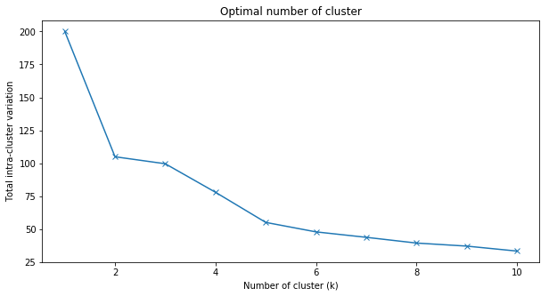

$$ 
\newcommand{\R}{\mathbb{R}}
\renewcommand{\vec}[1]{\mathbf{#1}}
\newcommand{\X}{\mathcal{X}}
\newcommand{\D}{\mathcal{D}}
\newcommand{\G}{\mathcal{G}}
\newcommand{\L}{\mathcal{L}}
\newcommand{\X}{\mathcal{X}}
\newcommand{\Parents}{\mathrm{Parents}}
\newcommand{\NonDesc}{\mathrm{NonDesc}}
\newcommand{\I}{\mathcal{I}}
\newcommand{\dsep}{\text{d-sep}}
\newcommand{\Cat}{\mathrm{Categorical}}
\newcommand{\Bin}{\mathrm{Binomial}}
$$

# Agglomerative Hierarchical Clustering
In real world, grouping similar items is quite useful, such as recommending similar articles to users who are interested in specific news, and recommending specific products to groups of customers based on similar behaviors. ***Hierarchical clustering*** is one of the effective methods to achieve this goal.  

> ***Hierarchical clustering*** is an unsupervised learning algorithm that groups similar objects into groups called clusters. The endpoint is a set of clusters, where each cluster is distinct from each other cluster, and the objects within each cluster are broadly similar to each other. 

There are two types of hierarchical clustering strategies: ***Agglomerative*** and ***Divisive***. In ***Agglomerative Clustering***, we regard each observation as a data point and define it as a cluster at the beginning. Then, pairs of clusters are merged as one moves up the hierarchy, depending on the distance between each other.


## Average Linkage Method
There are five different methods for agglomerative hierarchical clustering: ***Single Linkage***, ***Complete Linkage***, ***Average Linkage***, ***Ward Method***, and ***Centroid Method***. The most commonly used linkages are single, complete and average. The reason why we adopt average linkage here is it overcomes the limitation of other two methods (Yim & Ramdeen, 2015):  

+ Concern on single linkage:
As it defines the minimum distance between cases from two clusters as the distance between two clusters, the clusters would be merged together just because one case from a cluster and one from another cluster are close to each other, which could produce chaining effect and lead the result to deviate from the reality.  

+ Concern on complete linkage:
Though this method avoids the chaining effect, it will be largely affected by the outliers. For example, if one case from cluster 2 is considerably far from the rest cases in cluster 2 and the cases from cluster 1, then cluster 1 and cluster 2 would not be able to be joined together even though all cases from 2 clusters are quite close except for the outlier.

Average linkage is the compromise between above linkage measures, providing a more accurate and appropriate evaluation of the inter-cluster distance. Hence, our tutorial adopts average linkage in hierarchical clustering. 
In average linkage, we can define the distance between two clusters to be the average distance between all data points in the first cluster and all data points in the second cluster. On the basis of this definition of distance between clusters, at each stage of the process we combine the two clusters that have the smallest average linkage distance.


## Elbow Method
Elbow method is one of the cluster stopping rules for deciding the optimal number of clusters. According to [wikipedia](https://en.wikipedia.org/wiki/Elbow_method_(clustering)), the marginal effect of decreasing intra-cluster variance by introducing new clusters is reducing. At a specific point, the new cluster would not add as much information as before. Hence, when we plot the total intra-cluster variation (WSS) against the number of clusters, there will be a inflection point on the graph, which would be our optimal cut-off point by Elbow method.  

The formula to calculate the total intra-cluster variation (WSS): $$ \sum_{i=1}^k\sum_{\vec{x}\in S_i}(\vec{x}-\mu_i)^2 $$ where we partition a set of observations $\vec{x} = (x_1, x_2, ., x_n)$ into k ($\leq n$) clusters $\vec{S} = {S_1, S_2, ., S_k}$

## Dataset Used
We'll use the built-in R data set [USArrests](https://www.kaggle.com/deepakg/usarrests), which contains statistics in arrests per 100,000 residents for assault`Assault`, murder`Murder`, and rape`Rape` in each of the 50 US states in 1973. It also gives the percent of the population living in urban areas`UrbanPop`. Thus, it is a dataframe with 50 observations on 4 variables.  
Hierarchical clustering can be applied to the situation when underlying data has a hierarchical structure. Its time complexity is generally in the order of O(n 2 logn), where n is the number of data points. So, when the number of data points is too large, we may not want to rely on Hierarchical clustering.

# Methods {.tabset .tabset-fade .tabset-pills} 

## R

R packages required:

```{r}
### use package 'cluster' to do hierarchical clustering
library('cluster')
### use package 'factoextra'and 'dplyr' to do elbow method
library('dplyr')
library('factoextra')
```

### Data Preparation

Firstly, we load data from R as df.

```{r load data}
df=USArrests
```

Then, view the first six lines of the dataframe by head().

```{r view head of data,eval=TRUE}
head(df)
```

Make a summary of the data to see the statistics properties of the data set.

```{r summarize data,eval=TRUE}
summary(df)
```

As we don't want the clustering algorithm to depend to an arbitrary variable unit, we start by standardizing the data using scale() and then view the new data.

```{r standardize data,eval=TRUE}
df <- scale(df)
head(df)
```


### Agglomerative Hierarchical Clustering

Great! Now we can come to the clustering!
In R, we use package 'cluster' to do agglomerative hierarchical clustering. We use `dist` to calculate the Euclidean Distance between each obeservation and divide them to different clusters according to the average distance. Finally, we plot the dendrograms to illustrate the outcome of hierarchical clustering.

```{r cluster and draw dendrogram plot,eval=TRUE}
### compute the dissimilarity values

d <- dist(df, method = "euclidean")

### Hierarchical clustering using Average Linkage

hc1 <- hclust(d, method = "average" )

# Plot the obtained dendrogram
plot(hc1, cex = 0.6, hang = -1)

```

### Determining the Number of Clusters

#### Elbow Method

The height of the cut to the dendrogram controls the number of clusters obtained. It plays the same role as the k in k-means clustering. Thus, we need to decide the value of k first.

We use Elbow Method to determine the number of clusters obtained.

Firstly, write a finction f to compute the WSS of each k.

```{r determine number of clusters,eval=TRUE}
###  write a function to compute WSS of each k
f=function(k){
sub_grp <- cutree(hc1, k)
df=as.data.frame(df)
df2=df %>%
  mutate(cluster = sub_grp)%>%
  group_by(cluster)%>%
  summarize(M=mean(Murder),A=mean(Assault),U=mean(UrbanPop),R=mean(Rape))
df1=df %>%
  mutate(cluster = sub_grp)
df3=left_join(df1,df2,by="cluster")
D=(df3$Murder-df3$M)^2+(df3$Assault-df3$A)^2+(df3$UrbanPop-df3$U)^2+(df3$Rape-df3$R)^2
df4=cbind(df3,D)
WSS=sum(df4$D)
WSS
}

```

Then, plot the WSS against k to find the inflection point.

```{r Elbow Method plot, eval=TRUE}
### plot WSS against each k from 1 to 10
WSS=c()
for (i in 1:10){WSS[i]=f(i)}
K=c(1:10)
SSW_K=as.data.frame(cbind(WSS,K))
p=ggplot(SSW_K, aes(x=K, y=WSS)) + geom_line() + geom_point()
p + scale_x_continuous(breaks=K, labels = K) + labs(title = "Elbow Method")
```

From the plot above we can see that if k < 5, the change of WSS is very fast; While k > 5, the change of WSS becomes slow. Thus, we can determine the number of clusters is 5.

Now we divide the states into 5 clusters based on the outcomes of agglomerative hierarchical clustering.

```{r divide 5 clusters, eval=TRUE}
plot(hc1, cex = 0.6)
rect.hclust(hc1, k = 5, border = 2:5)
```

## STATA

### Data Preparation

Like R and Python, we should load the data into STATA first. We use `import delimited` to do that.

```{r load data1, eval=FALSE}
clear
set more off 

import delimited "./USArrests.csv"
```

`list in 1/6` command allows us to view the first 6 rows of the data. We use `rename` command to change the variable name and label it using `label`.  

```{r view head of data1, eval=FALSE}
list in 1/6

    +-------------------------------------------------+
     |         v1   murder   assault   urbanpop   rape |
     |-------------------------------------------------|
  1. |    Alabama     13.2       236         58   21.2 |
  2. |     Alaska       10       263         48   44.5 |
  3. |    Arizona      8.1       294         80     31 |
  4. |   Arkansas      8.8       190         50   19.5 |
  5. | California        9       276         91   40.6 |
     |-------------------------------------------------|
  6. |   Colorado      7.9       204         78   38.7 |
     +-------------------------------------------------+

rename v1 state 
label variable state "State"
```

`describe` could display the type of different variables, and `summarize` shows us the summary information of the data.  

```{r summarize data1, eval=FALSE}
describe 

Contains data
  obs:            50                          
 vars:             5                          
 size:         1,250                          
--------------------------------------------------------------------------------------------------------------------------------------------
              storage   display    value
variable name   type    format     label      variable label
--------------------------------------------------------------------------------------------------------------------------------------------
state           str14   %14s                  State
murder          float   %9.0g                 Murder
assault         int     %8.0g                 Assault
urbanpop        byte    %8.0g                 UrbanPop
rape            float   %9.0g                 Rape
--------------------------------------------------------------------------------------------------------------------------------------------
Sorted by: 
     Note: Dataset has changed since last saved.


summarize 


    Variable |        Obs        Mean    Std. Dev.       Min        Max
-------------+---------------------------------------------------------
       state |          0
      murder |         50       7.788     4.35551         .8       17.4
     assault |         50      170.76    83.33766         45        337
    urbanpop |         50       65.54    14.47476         32         91
        rape |         50      21.232    9.366384        7.3         46


```

As the variable *state* stored in string format, there is no summary data.  

#### Data Normalization
As we don’t want the clustering algorithm to depend to an arbitrary variable unit, we start by standardizing the data. To standardize data, we use `std` in STATA. Here we use a loop to standardize different variables.

```{r standardize data1, eval=FALSE}
foreach var in murder assault urbanpop rape {
	egen `var'_new = std(`var')
	}	
```

This is our new data.

```{r standardization result, eval=FALSE}
list in 1/6 

     +-----------------------------------------------------------------------------------------------+
     |      state   murder   assault   urbanpop   rape   murder~w   assaul~w   urbanpo~w    rape_new |
     |-----------------------------------------------------------------------------------------------|
  1. |    Alabama     13.2       236         58   21.2   1.242564   .7828394   -.5209066   -.0034164 |
  2. |     Alaska       10       263         48   44.5   .5078625   1.106822   -1.211764    2.484203 |
  3. |    Arizona      8.1       294         80     31   .0716335   1.478803      .99898    1.042878 |
  4. |   Arkansas      8.8       190         50   19.5   .2323494    .230868   -1.073593   -.1849166 |
  5. | California        9       276         91   40.6   .2782682   1.262814    1.758923     2.06782 |
     |-----------------------------------------------------------------------------------------------|
  6. |   Colorado      7.9       204         78   38.7   .0257146   .3988593    .8608086    1.864967 |
     +-----------------------------------------------------------------------------------------------+


```

### Perform Agglomerative Hierarchical Clustering

Great! Now we can come to the clustering! In STATA, we use `cluster linkage variables, name(name of resulting cluster analysis)` to complete the task, and option `dendrogram` helps us visualize the cluster. 

```{r cluster dendrogram, eval=FALSE}
cluster averagelinkage murder_new assault_new urbanpop_new rape_new, name(cluster2)
cluster dendrogram cluster2, labels(state) xlabel(, angle(90) labsize(*.75)) title("Hierarchical Clustering Dendrogram")
```


### Determining the Number of Clusters

#### Elbow Method

Then we generate 1 to 10 clusters solutions for states and preparign for Elbow methods comparison using `groups` function. The states will be assigned to different groups.
```{r generate cluster solutions, eval=FALSE}
cluster gen avg = groups(1/10), name(cluster2)
```

The result will be like this:

```{r display grouop result, eval=FALSE}
list in 1/6

     +-----------------------------------------------------------------------------------+
     |      state   avg1   avg2   avg3   avg4   avg5   avg6   avg7   avg8   avg9   avg10 |
     |-----------------------------------------------------------------------------------|
  1. |    Alabama      1      1      1      1      1      1      1      1      1       1 |
  2. |     Alaska      1      1      2      3      3      3      4      4      5       6 |
  3. |    Arizona      1      1      1      2      2      2      2      2      2       3 |
  4. |   Arkansas      1      2      3      4      4      4      5      5      6       7 |
  5. | California      1      1      1      2      2      2      3      3      4       5 |
     |-----------------------------------------------------------------------------------|
  6. |   Colorado      1      1      1      2      2      2      2      2      2       3 |
     +-----------------------------------------------------------------------------------+


```

Below is how we create the within-cluster sum of squares (WSS) matrix. We use forloop to iterate various clusters and generate WSS.

```{r eval=FALSE}
matrix WSS = J(10,2,.)       // create an empty matrix with 10 rows 2 columns.
matrix colnames WSS = k WSS  // set column name  

forvalues k = 1(1)10 {
  scalar ws`k' = 0
  foreach v of varlist murder_new assault_new urbanpop_new rape_new {
    quietly anova `v' avg`k' // use anova to get the WSS stored in "rss"
    scalar ws`k' = ws`k' + e(rss)
    }
  matrix WSS[`k', 1] = `k'   // fill in the first column as number of clusters
  matrix WSS[`k', 2] = ws`k' // the second column of the matrix is the WSS value
  }
```

Here is our Elbow plot.
```{r plot, eval=FALSE}
_matplot WSS, columns(2 1) connect(l) xlabel(#10) name(plot1, replace) title ("Optimal number of cluster")
```

As the graph suggests, after 5 clusters, the reducing speed of WSS becomes much slower. Hence, the best number of clusters is 5 according to Elbow method. We use `line` to superimpose a horizontal line on the plot.

```{r clustering, eval=FALSE}
cluster dendrogram cluster2, labels(state) xlabel(, angle(90) labsize(*.75)) title("Hierarchical Clustering Dendrogram") yline (2)
```


## Python

```python
from matplotlib import pyplot as plt
from scipy.cluster.hierarchy import dendrogram, linkage
from sklearn import preprocessing
import numpy as np
import pandas as pd
%matplotlib inline
```


```python
crimerate_data = pd.read_csv('USArrests.csv')
```

### Data Preparation
####  Normalize the features to make variables comparable
Since `Murder`, `Assault`, and `Rape` are in unit *per 100,000*, while `UrbanPop` is in *percent*, we need first to normalize all the features.


```python
statesList = crimerate_data.iloc[:, 0].values # label 
data = crimerate_data.iloc[:, 1:5].values
```


```python
data_scaled = preprocessing.scale(data)
```

We can check the normalized results by


```python
data_scaled.mean(axis=0)
```


    array([-7.10542736e-17,  1.38777878e-16, -4.39648318e-16,  8.59312621e-16])


```python
data_scaled.std(axis=0)
```


    array([1., 1., 1., 1.])


### Perform the Hierarchical Clustering


```python
# generate the linkage matrix ('average' method is selected)
linked = linkage(data_scaled, 'average')
```

#### To check the [Cophenetic Correlation Coefficient](https://en.wikipedia.org/wiki/Cophenetic_correlation)


```python
from scipy.cluster.hierarchy import cophenet
from scipy.spatial.distance import pdist # computing the distance

c, coph_dists = cophenet(linked, pdist(data_scaled))
```

The closer the value is to 1, the better the clustering preserves the original distances


```python
c
```


    0.7180382379320472


#### The Linkage Matrix
The linkage matrix is an array of length `n - 1`, where `n` is the number of our starting singleton clusters.  
`linked[i]` includes the information of which two clusters are merged at iteration `i` according the selected evalutation metric.  
For example: 


```python
linked[0] 
```


    array([14.       , 28.       ,  0.2079438,  2.       ])


The returned array is in the format of `[idx1, idx2, dist, sample_count]`. Therefore, at iteration `0`, since indices `14` and `28` only have a distance of `0.2079438`, they are merged together first.


```python
linked[:10]
```


    array([[14.        , 28.        ,  0.2079438 ,  2.        ],
           [12.        , 31.        ,  0.35377437,  2.        ],
           [13.        , 15.        ,  0.43312429,  2.        ],
           [22.        , 48.        ,  0.49909939,  2.        ],
           [35.        , 52.        ,  0.53043045,  3.        ],
           [19.        , 30.        ,  0.54082482,  2.        ],
           [18.        , 50.        ,  0.57847034,  3.        ],
           [36.        , 46.        ,  0.59956023,  2.        ],
           [45.        , 54.        ,  0.67765914,  4.        ],
           [40.        , 47.        ,  0.71809843,  2.        ]])


It can be noticed that `idx2` of `linked[4]` is `52`, but we only have `50` data points in total. Actually, all `idx >= 50` represents the cluster gererated in `linked[idx - 50]`. Therefore, for this case it just means to merge sample `35 (Oklahoma)` to our samples `13 (Indiana)` and `15 (Kansas)`. 

#### Plotting a Dendrogram


```python
plt.figure(figsize=(12, 6)) 
plt.title('Hierarchical Clustering Dendrogram')
plt.xlabel('States')
plt.ylabel('distance')
dendrogram(linked,
           orientation='top', #The direction to plot the dendrogram
                              #The root at the top, and descendent links going downwards
           labels=statesList,
           distance_sort='descending',
           show_leaf_counts=True)
plt.show()
```


According to [this](http://nbviewer.jupyter.org/github/OxanaSachenkova/hclust-python/blob/master/hclust.ipynb), we can visualize the distance between clusters by plotting the heatmap


```python
from scipy.spatial.distance import squareform

# Compute and plot first dendrogram.
fig = plt.figure(figsize=(9,9))
# x ywidth height
ax1 = fig.add_axes([0.05,0.1,0.2,0.6])
Y = linked
Z1 = dendrogram(Y, orientation='right',labels=statesList) # adding/removing the axes
ax1.set_xticks([])

# Compute and plot second dendrogram.
ax2 = fig.add_axes([0.3,0.71,0.6,0.2])
Z2 = dendrogram(Y)
ax2.set_xticks([])
ax2.set_yticks([])

#Compute and plot the heatmap
axmatrix = fig.add_axes([0.3,0.1,0.6,0.6])
idx1 = Z1['leaves']
idx2 = Z2['leaves']
D = squareform(pdist(data_scaled))
D = D[idx1,:]
D = D[:,idx2]
im = axmatrix.matshow(D, aspect='auto', origin='lower', cmap=plt.cm.YlGnBu)
axmatrix.set_xticks([])
axmatrix.set_yticks([])

# Plot colorbar.
axcolor = fig.add_axes([0.91,0.1,0.02,0.6])
plt.colorbar(im, cax=axcolor)
```


    <matplotlib.colorbar.Colorbar at 0x1a14d702b0>


### Determining the Number of Clusters

#### Elbow Method
According to [wikipedia](https://en.wikipedia.org/wiki/Elbow_method_(clustering)), the goal is to minimize the total intra-cluster variation (WSS). Therefore, we can implement the Elbow Method as a reference for determining the optimal number of clusters:


```python
from sklearn.cluster import AgglomerativeClustering

def wss_calculation(K, data):
    WSS = []
    for i in range(K):
        cluster = AgglomerativeClustering(n_clusters= i+1, affinity='euclidean', linkage='average')  
        cluster.fit_predict(data)
        # cluster index
        label = cluster.labels_
        wss = []
        for j in range(i+1):
            # extract each cluster according to its index
            idx = [t for t, e in enumerate(label) if e == j]
            cluster = data[idx,]
            # calculate the WSS:
            cluster_mean = cluster.mean(axis=0)
            distance = np.sum(np.abs(cluster - cluster_mean)**2,axis=-1)
            wss.append(sum(distance))
        WSS.append(sum(wss))
    return WSS
```


```python
WSS=wss_calculation(10, data_scaled)
```


```python
cluster_range = range(1, 11)

plt.figure(figsize=(10,5))
plt.title('Optimal number of cluster')
plt.xlabel('Number of cluster (k)')
plt.ylabel('Total intra-cluster variation')
plt.plot(cluster_range, WSS, marker = "x")
```


    [<matplotlib.lines.Line2D at 0x108a21c18>]





The gain in explained variance reduces significantly from 4 to 5 to 6 ('elbow' is at k = 5). So, optimal number of clusters could be 5.  
Alternatively, we can just focus on finding where the acceleration of distance growth is the biggest:


```python
last = linked[-10:, 2]
last_rev = last[::-1]
idxs = np.arange(1, len(last) + 1)

plt.figure(figsize=(10,5))
plt.title('Optimal number of cluster')
plt.xlabel('Number of cluster')

plt.plot(idxs, last_rev, marker = "o", label="distance")

accele = np.diff(last, 2)  # 2nd derivative of the distances
accele_rev = accele[::-1]
plt.plot(idxs[:-2] + 1, accele_rev, marker = "x", label = "2nd derivative of distance growth")

plt.legend()
plt.show()
k = accele_rev.argmax() + 2  # if idx 0 is the max of this we want 2 clusters
print ("clusters:", k)
```


    clusters: 5


### Plot Annotated Hierarchical Clustering Dendrograms
To illustrate the cut-off distance which determines the selected number of cluster, we can plot a horizontal line in the dendrogram. This line defines the minimum distance required to be a separate cluster. For many other cases, where there is a large number of samples, it will be concise to plot the annotated truncated dendrogram with cut-off line by using [fancy_dendrogram()](https://joernhees.de/blog/2015/08/26/scipy-hierarchical-clustering-and-dendrogram-tutorial/).


```python
# the following code is from
# [https://joernhees.de/blog/2015/08/26/scipy-hierarchical-clustering-and-dendrogram-tutorial/]
def fancy_dendrogram(*args, **kwargs):
    plt.figure(figsize=(10,5))
    max_d = kwargs.pop('max_d', None)
    if max_d and 'color_threshold' not in kwargs:
        kwargs['color_threshold'] = max_d
    annotate_above = kwargs.pop('annotate_above', 0)

    ddata = dendrogram(*args, **kwargs)

    if not kwargs.get('no_plot', False):
        plt.title('Hierarchical Clustering Dendrogram (truncated)')
        plt.xlabel('sample index or (cluster size)')
        plt.ylabel('distance')
        for i, d, c in zip(ddata['icoord'], ddata['dcoord'], ddata['color_list']):
            x = 0.5 * sum(i[1:3])
            y = d[1]
            if y > annotate_above:
                plt.plot(x, y, 'o', c=c)
                plt.annotate("%.3g" % y, (x, y), xytext=(0, -5),
                             textcoords='offset points',
                             va='top', ha='center')
        if max_d:
            plt.axhline(y=max_d, c='k')
    return ddata
```

#### Five clusters
According to the result of Elbow Method, we can select 5 clusters for our dataset, and therefore we can select the cut-off distance to be 2.0 as shown in the following figure.


```python
fancy_dendrogram(
    linked,
    truncate_mode='lastp',
    p=12,
    leaf_rotation=90.,
    leaf_font_size=12.,
    show_contracted=True,
    annotate_above=1,
    max_d=2,  # a horizontal cut-off line
)

plt.show()
```


# Summary

From the five clusters shown in the dendrogram above, we can see the outcomes of hierarchical clustering have some relationship with geographic locations of the 50 states. For example, most states in the south are divided into one cluster and Alaska is divided into another cluster itself. 

    

# References

1. [*SciPy Hierarchical Clustering and Dendrogram Tutorial*](https://joernhees.de/blog/2015/08/26/scipy-hierarchical-clustering-and-dendrogram-tutorial/)

2. [*Hierarchical Cluster Analysis: Comparison of Three Linkage Measures and Application to Psychological Data*](https://www.researchgate.net/publication/308015073_Hierarchical_Cluster_Analysis_Comparison_of_Three_Linkage_Measures_and_Application_to_Psychological_Data)

3. [*Hierarchical Cluster Analysis*](https://uc-r.github.io/hc_clustering#kmeans_clustering)

4. [*Determining the number of clusters in a data set*](https://en.wikipedia.org/wiki/Determining_the_number_of_clusters_in_a_data_set)


