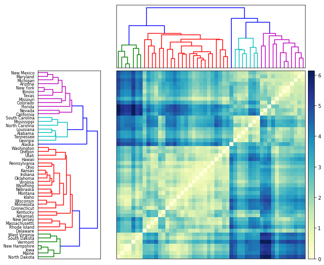

$$ \LaTeX \text{ command declarations here.}
\newcommand{\R}{\mathbb{R}}
\renewcommand{\vec}[1]{\mathbf{#1}}
\newcommand{\X}{\mathcal{X}}
\newcommand{\D}{\mathcal{D}}
\newcommand{\G}{\mathcal{G}}
\newcommand{\L}{\mathcal{L}}
\newcommand{\X}{\mathcal{X}}
\newcommand{\Parents}{\mathrm{Parents}}
\newcommand{\NonDesc}{\mathrm{NonDesc}}
\newcommand{\I}{\mathcal{I}}
\newcommand{\dsep}{\text{d-sep}}
\newcommand{\Cat}{\mathrm{Categorical}}
\newcommand{\Bin}{\mathrm{Binomial}}
$$


```python
from matplotlib import pyplot as plt
from scipy.cluster.hierarchy import dendrogram, linkage
from sklearn import preprocessing
import numpy as np
import pandas as pd
%matplotlib inline
```


```python
crimerate_data = pd.read_csv('USArrests.csv')
```

### Data Preparation
####  Normalize the features to make variables comparable
Since `Murder`, `Assault`, and `Rape` are in unit *per 100,000*, while `UrbanPop` is in *percent*, we need first to normalize all the features.


```python
statesList = crimerate_data.iloc[:, 0].values # label 
data = crimerate_data.iloc[:, 1:5].values
```


```python
data_scaled = preprocessing.scale(data)
```

We can check the normalized results by


```python
data_scaled.mean(axis=0)
```


    array([-7.10542736e-17,  1.38777878e-16, -4.39648318e-16,  8.59312621e-16])


```python
data_scaled.std(axis=0)
```


    array([1., 1., 1., 1.])


### Perform the Hierarchical Clustering¶


```python
# generate the linkage matrix ('average' method is selected)
linked = linkage(data_scaled, 'average')
```

#### To check the [Cophenetic Correlation Coefficient](https://en.wikipedia.org/wiki/Cophenetic_correlation)


```python
from scipy.cluster.hierarchy import cophenet
from scipy.spatial.distance import pdist # computing the distance

c, coph_dists = cophenet(linked, pdist(data_scaled))
```

The closer the value is to 1, the better the clustering preserves the original distances


```python
c
```


    0.7180382379320472


#### The Linkage Matrix
The linkage matrix is an array of length `n - 1`, where `n` is the number of our starting singleton clusters.  
`linked[i]` includes the information of which two clusters are merged at iteration `i` according the selected evalutation metric.  
For example: 


```python
linked[0] 
```


    array([14.       , 28.       ,  0.2079438,  2.       ])


The returned array is in the format of `[idx1, idx2, dist, sample_count]`. Therefore, at iteration `0`, since indices `14` and `28` only have a distance of `0.2079438`, they are merged together first.


```python
linked[:10]
```


    array([[14.        , 28.        ,  0.2079438 ,  2.        ],
           [12.        , 31.        ,  0.35377437,  2.        ],
           [13.        , 15.        ,  0.43312429,  2.        ],
           [22.        , 48.        ,  0.49909939,  2.        ],
           [35.        , 52.        ,  0.53043045,  3.        ],
           [19.        , 30.        ,  0.54082482,  2.        ],
           [18.        , 50.        ,  0.57847034,  3.        ],
           [36.        , 46.        ,  0.59956023,  2.        ],
           [45.        , 54.        ,  0.67765914,  4.        ],
           [40.        , 47.        ,  0.71809843,  2.        ]])


It can be noticed that `idx2` of `linked[4]` is `52`, but we only have `50` data points in total. Actually, all `idx >= 50` represents the cluster gererated in `linked[idx - 50]`. Therefore, for this case it just means to merge sample `35 (Oklahoma)` to our samples `13 (Indiana)` and `15 (Kansas)`. 

#### Plotting a Dendrogram


```python
plt.figure(figsize=(12, 6)) 
plt.title('Hierarchical Clustering Dendrogram')
plt.xlabel('States')
plt.ylabel('distance')
dendrogram(linked,
           orientation='top', #The direction to plot the dendrogram
                              #The root at the top, and descendent links going downwards
           labels=statesList,
           distance_sort='descending',
           show_leaf_counts=True)
plt.show()
```


According to [this](http://nbviewer.jupyter.org/github/OxanaSachenkova/hclust-python/blob/master/hclust.ipynb), we can visualize the distance between clusters by plotting the heatmap


```python
from scipy.spatial.distance import squareform

# Compute and plot first dendrogram.
fig = plt.figure(figsize=(9,9))
# x ywidth height
ax1 = fig.add_axes([0.05,0.1,0.2,0.6])
Y = linked
Z1 = dendrogram(Y, orientation='right',labels=statesList) # adding/removing the axes
ax1.set_xticks([])

# Compute and plot second dendrogram.
ax2 = fig.add_axes([0.3,0.71,0.6,0.2])
Z2 = dendrogram(Y)
ax2.set_xticks([])
ax2.set_yticks([])

#Compute and plot the heatmap
axmatrix = fig.add_axes([0.3,0.1,0.6,0.6])
idx1 = Z1['leaves']
idx2 = Z2['leaves']
D = squareform(pdist(data_scaled))
D = D[idx1,:]
D = D[:,idx2]
im = axmatrix.matshow(D, aspect='auto', origin='lower', cmap=plt.cm.YlGnBu)
axmatrix.set_xticks([])
axmatrix.set_yticks([])

# Plot colorbar.
axcolor = fig.add_axes([0.91,0.1,0.02,0.6])
plt.colorbar(im, cax=axcolor)
```


    <matplotlib.colorbar.Colorbar at 0x1a14d702b0>





### Determining the Number of Clusters

#### Elbow Method
According to [wikipedia](https://en.wikipedia.org/wiki/Elbow_method_(clustering), the goal is to minimize the total intra-cluster variation (WSS). Therefore, we can implement the Elbow Method as a reference for determining the optimal number of clusters:


```python
from sklearn.cluster import AgglomerativeClustering

def wss_calculation(K, data):
    WSS = []
    for i in range(K):
        cluster = AgglomerativeClustering(n_clusters= i+1, affinity='euclidean', linkage='average')  
        cluster.fit_predict(data)
        # cluster index
        label = cluster.labels_
        wss = []
        for j in range(i+1):
            # extract each cluster according to its index
            idx = [t for t, e in enumerate(label) if e == j]
            cluster = data[idx,]
            # calculate the WSS:
            cluster_mean = cluster.mean(axis=0)
            distance = np.sum(np.abs(cluster - cluster_mean)**2,axis=-1)
            wss.append(sum(distance))
        WSS.append(sum(wss))
    return WSS
```


```python
WSS=wss_calculation(10, data_scaled)
```


```python
cluster_range = range(1, 11)

plt.figure(figsize=(10,5))
plt.title('Optimal number of cluster')
plt.xlabel('Number of cluster (k)')
plt.ylabel('Total intra-cluster variation')
plt.plot(cluster_range, WSS, marker = "x")
```


    [<matplotlib.lines.Line2D at 0x108a21c18>]


The gain in explained variance reduces significantly from 4 to 5 to 6 ('elbow' is at k = 5). So, optimal number of clusters could be either 5.  
Alternatively, we can just focus on finding where the acceleration of distance growth is the biggest:


```python
last = linked[-10:, 2]
last_rev = last[::-1]
idxs = np.arange(1, len(last) + 1)

plt.figure(figsize=(10,5))
plt.title('Optimal number of cluster')
plt.xlabel('Number of cluster')

plt.plot(idxs, last_rev, marker = "o", label="distance")

accele = np.diff(last, 2)  # 2nd derivative of the distances
accele_rev = accele[::-1]
plt.plot(idxs[:-2] + 1, accele_rev, marker = "x", label = "2nd derivative of distance growth")

plt.legend()
plt.show()
k = accele_rev.argmax() + 2  # if idx 0 is the max of this we want 2 clusters
print ("clusters:", k)
```


    clusters: 5


### Plot Annotated Hierarchical Clustering Dendrograms
To illustrate the cut-off distance which determines the selected number of cluster, we can plot a horizontal line in the dendrogram. This line defines the minimum distance required to be a separate cluster. For many other cases, where there is a large number of samples, it will be concise to plot the annotated truncated dendrogram with cut-off line by using [fancy_dendrogram()](https://joernhees.de/blog/2015/08/26/scipy-hierarchical-clustering-and-dendrogram-tutorial/).


```python
# the following code is from
# [https://joernhees.de/blog/2015/08/26/scipy-hierarchical-clustering-and-dendrogram-tutorial/]
def fancy_dendrogram(*args, **kwargs):
    plt.figure(figsize=(10,5))
    max_d = kwargs.pop('max_d', None)
    if max_d and 'color_threshold' not in kwargs:
        kwargs['color_threshold'] = max_d
    annotate_above = kwargs.pop('annotate_above', 0)

    ddata = dendrogram(*args, **kwargs)

    if not kwargs.get('no_plot', False):
        plt.title('Hierarchical Clustering Dendrogram (truncated)')
        plt.xlabel('sample index or (cluster size)')
        plt.ylabel('distance')
        for i, d, c in zip(ddata['icoord'], ddata['dcoord'], ddata['color_list']):
            x = 0.5 * sum(i[1:3])
            y = d[1]
            if y > annotate_above:
                plt.plot(x, y, 'o', c=c)
                plt.annotate("%.3g" % y, (x, y), xytext=(0, -5),
                             textcoords='offset points',
                             va='top', ha='center')
        if max_d:
            plt.axhline(y=max_d, c='k')
    return ddata
```

## Five clusters
According to the result of Elbow Method, we can select 5 clusters for our dataset, and therefore we can select the cut-off distance to be 2.0 as shown in the following figure.


```python
fancy_dendrogram(
    linked,
    truncate_mode='lastp',
    p=12,
    leaf_rotation=90.,
    leaf_font_size=12.,
    show_contracted=True,
    annotate_above=1,
    max_d=2,  # a horizontal cut-off line
)

plt.show()
```


