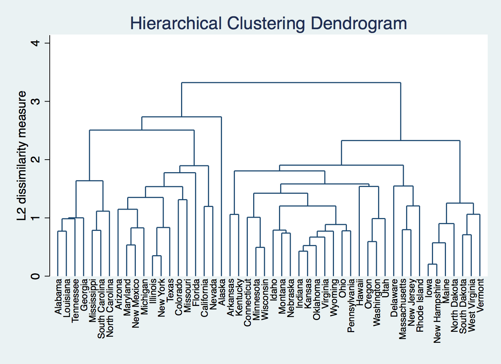

### Hierarchical clustering using STATA
Like R and Python, we should load the data into STATA first. We use `import delimited` to do that.

```{r load data, eval=FALSE}
clear
set more off 

import delimited "./USArrests.csv"
```

`list in 1/6` command allows us to view the first 6 rows of the data. We use `rename` command to change the variable name and label it using `label`.  

```{r view head of data, eval=FALSE}
list in 1/6

    +-------------------------------------------------+
     |         v1   murder   assault   urbanpop   rape |
     |-------------------------------------------------|
  1. |    Alabama     13.2       236         58   21.2 |
  2. |     Alaska       10       263         48   44.5 |
  3. |    Arizona      8.1       294         80     31 |
  4. |   Arkansas      8.8       190         50   19.5 |
  5. | California        9       276         91   40.6 |
     |-------------------------------------------------|
  6. |   Colorado      7.9       204         78   38.7 |
     +-------------------------------------------------+

rename v1 state 
label variable state "State"
```

`describe` could display the type of different variables, and `summarize` shows us the summary information of the data.  

```{r summarize data, eval=FALSE}
describe 

Contains data
  obs:            50                          
 vars:             5                          
 size:         1,250                          
--------------------------------------------------------------------------------------------------------------------------------------------
              storage   display    value
variable name   type    format     label      variable label
--------------------------------------------------------------------------------------------------------------------------------------------
state           str14   %14s                  State
murder          float   %9.0g                 Murder
assault         int     %8.0g                 Assault
urbanpop        byte    %8.0g                 UrbanPop
rape            float   %9.0g                 Rape
--------------------------------------------------------------------------------------------------------------------------------------------
Sorted by: 
     Note: Dataset has changed since last saved.


summarize 


    Variable |        Obs        Mean    Std. Dev.       Min        Max
-------------+---------------------------------------------------------
       state |          0
      murder |         50       7.788     4.35551         .8       17.4
     assault |         50      170.76    83.33766         45        337
    urbanpop |         50       65.54    14.47476         32         91
        rape |         50      21.232    9.366384        7.3         46


```

As the variable *state* stored in string format, there is no summary data.    

As we don’t want the clustering algorithm to depend to an arbitrary variable unit, we start by standardizing the data. To standardize data, we use `std` in STATA. Here we use a loop to standardize different variables.

```{r standardize data, eval=FALSE}
foreach var in murder assault urbanpop rape {
	egen `var'_new = std(`var')
	}	
```

This is our new data.

```{r standardization result, eval=FALSE}
list in 1/6 

     +-----------------------------------------------------------------------------------------------+
     |      state   murder   assault   urbanpop   rape   murder~w   assaul~w   urbanpo~w    rape_new |
     |-----------------------------------------------------------------------------------------------|
  1. |    Alabama     13.2       236         58   21.2   1.242564   .7828394   -.5209066   -.0034164 |
  2. |     Alaska       10       263         48   44.5   .5078625   1.106822   -1.211764    2.484203 |
  3. |    Arizona      8.1       294         80     31   .0716335   1.478803      .99898    1.042878 |
  4. |   Arkansas      8.8       190         50   19.5   .2323494    .230868   -1.073593   -.1849166 |
  5. | California        9       276         91   40.6   .2782682   1.262814    1.758923     2.06782 |
     |-----------------------------------------------------------------------------------------------|
  6. |   Colorado      7.9       204         78   38.7   .0257146   .3988593    .8608086    1.864967 |
     +-----------------------------------------------------------------------------------------------+


```

Great! Now we can come to the clustering! In STATA, we use `cluster linkage variables, name(name of resulting cluster analysis)` to complete the task, and option `dendrogram` helps us visualize the cluster. 

```{r cluster dendrogram, eval=FALSE}
cluster averagelinkage murder_new assault_new urbanpop_new rape_new, name(cluster2)
cluster dendrogram cluster2, labels(state) xlabel(, angle(90) labsize(*.75)) title("Hierarchical Clustering Dendrogram")
```

Then we generate 1 to 10 clusters solutions for states and preparign for Elbow methods comparison using `groups` function. The states will be assigned to different groups.
```{r generate cluster solutions, eval=FALSE}
cluster gen avg = groups(1/10), name(cluster2)
```

The result will be like this:

```{r display grouop result, eval=FALSE}
list in 1/6

     +-----------------------------------------------------------------------------------+
     |      state   avg1   avg2   avg3   avg4   avg5   avg6   avg7   avg8   avg9   avg10 |
     |-----------------------------------------------------------------------------------|
  1. |    Alabama      1      1      1      1      1      1      1      1      1       1 |
  2. |     Alaska      1      1      2      3      3      3      4      4      5       6 |
  3. |    Arizona      1      1      1      2      2      2      2      2      2       3 |
  4. |   Arkansas      1      2      3      4      4      4      5      5      6       7 |
  5. | California      1      1      1      2      2      2      3      3      4       5 |
     |-----------------------------------------------------------------------------------|
  6. |   Colorado      1      1      1      2      2      2      2      2      2       3 |
     +-----------------------------------------------------------------------------------+


```

Below is how we create the within-cluster sum of squares (WSS) matrix. We use forloop to iterate various clusters and generate WSS.

```{r eval=FALSE}
matrix WSS = J(10,2,.)       // create an empty matrix with 10 rows 2 columns.
matrix colnames WSS = k WSS  // set column name  

forvalues k = 1(1)10 {
  scalar ws`k' = 0
  foreach v of varlist murder_new assault_new urbanpop_new rape_new {
    quietly anova `v' avg`k' // use anova to get the WSS stored in "rss"
    scalar ws`k' = ws`k' + e(rss)
    }
  matrix WSS[`k', 1] = `k'   // fill in the first column as number of clusters
  matrix WSS[`k', 2] = ws`k' // the second column of the matrix is the WSS value
  }
```

Here is our Elbow plot.
```{r plot, eval=FALSE}
_matplot WSS, columns(2 1) connect(l) xlabel(#10) name(plot1, replace) title ("Optimal number of cluster")
```

As the graph suggests, after 5 clusters, the reducing speed of WSS becomes much slower. Hence, the best number of clusters is 5 according to Elbow method. We use `line` to superimpose a horizontal line on the plot.

```{r clustering, eval=FALSE}
cluster dendrogram cluster2, labels(state) xlabel(, angle(90) labsize(*.75)) title("Hierarchical Clustering Dendrogram") yline (2)
```


